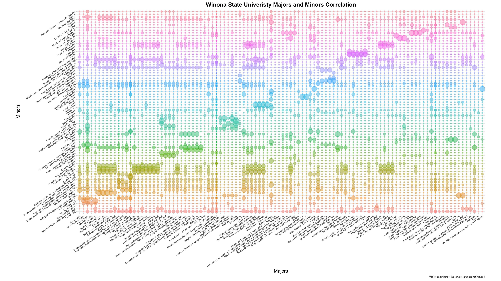
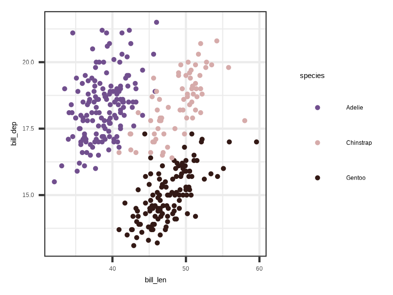

My passion for working with data started during the summer break after my first year of my undergraduate degree. At the time, I was double majoring in mathematics and statistics, but I had just taken the introductory data science course. I instantly found a spark for working with data in R and read through R for Data Science by Hadley Wickham (<https://r4ds.hadley.nz>). Since then, I have worked on numerous projects for personal development and my own curiosity. 


## Overlap of Majors and Minors at Winona State University

One of my very first projects in R came up in a conversation with a friend about which minors at Winona State would be the easiest to complete depending on the major. He never intended for me to figure out an "answer", but I decided to use the opportunity to learn about web scraping and data cleaning. Unfortunately, this was before I was using GitHub for my projects, and I lost the project when migrating my campus-provided laptop (a lesson I have since learned). Below are the steps I used to complete the analysis.

1. For all pages for majors and minors, extract all courses listed into a single data frame with columns for course and program.
2. Separate the data frame into a majors data frame and a minors data frame.
3. Full join majors and minors on a dummy variable to get all combinations of courses for each combination of majors and minors.
4. For each combination, compute the number of overlapping courses.
5. Divide the number of overlapping courses by the number of courses listed for the minor.

At the time, there were 110 majors and 77 minors available at Winona State. Below is an early iteration of my graphic, which was designed to be printed on a poster.

{fig-align='center' fig-width='100%'}

I recently decided to replicate this analysis and have the code available on [GitHub](https://github.com/TWiedRW/wsu-programs). The main improvement was limiting the number of majors to Bachelor of Science degrees and removing minors with low overlap. 


<!---
 
## March Madness Competition

My statistics department at UNL usually hosts an annual March Madness competition where we select teams in the bracket and compete based off the number of wins from their chosen teams. For fairness, we each have 100 points that can be used to purchase teams, where teams with higher seeds cost more points. In 2023, I got second place by selecting teams based off the distribution of points scored in regular season games. Rather than providing two web scraping projects in R here, I decided to replicate the analysis in Python. 

--->

## Color palette generation from images

In collaboration with [Muxin Hua](https://github.com/Hiiiua), we developed an R package focused on creating color palettes from images. The overall theory was to identify the colors in the image and use clustering to generate distinct separated colors. We also included a color-blind mode that initially put images through color filters before clustering. 

You can check out the GitHub page [here](https://github.com/Hiiiua/Photopal), or try it for yourself!

```{r, eval=FALSE, echo=TRUE}
# install.packages("devtools")
devtools::install_github("Hiiiua/Photopal")

library(Photopal)
library(ggplot2)

# Use demo image template
my_cols <- Photopal::palette_create(num.col = 3, df.rgb = image2rgb(), plot = F)

# Create plot using penguins dataset
penguins |>
  ggplot(mapping = aes(x = bill_len, y = bill_dep, color = species)) + 
  geom_point(size = 1/2) + 
  scale_color_manual(values = c(
    'Adelie'= my_cols[1,4],
    'Chinstrap' = my_cols[2,4],
    'Gentoo' = my_cols[3,4]
  )) + 
  theme_bw()
#ggsave('sample-plot.png', width = 806, height = 605, units = 'px')
```

:::{layout-ncol=2 out-width=90%}




:::

## This website!

Quarto offers many incredible features and I decided to use it to make this website. The code for this site can be found on [GitHub](https://github.com/TWiedRW/twiedrw.github.io). 

## Frequentist, Bayesian, and Visual Inference

Many statisticians find themselves somewhere in the paradigm of Frequentist and Bayesian methodologies. These methods often use data visualizations in various stages of analysis, but the formalization of using graphics for inference is a relatively newer development. 

In this paper, I compare Frequentist, Bayesian, and visual inference methods. As a hockey fan, I was curious if there were any game statistics other than goals (e.g., shots on goal) that contributed to the probability of winning a game. I web scraped data for the 2023-24 and 2024-25 seasons and used Frequentist and Bayesian methods to assess location (home/away), shots on goal, penalty minutes, power play goals, and power play opportunities. In the end, I was surprised that only power play goals contributed to the probability of winning. 

::: {.center text-align=center}

[Paper](https://TWiedRW.github.io/stat-992/paper-vis-inference/paper.pdf) | [GitHub](https://github.com/TWiedRW/stat-992/tree/main/paper-vis-inference)

:::

## Advanced Consulting Report

In my advanced consulting course, students functioned as a statistical consultant at the Statistical Cross-Disciplinary Collaboration & Consulting Lab in the Department of Statistics at UNL. At the end of the course, we had to put together a portfolio of projects that we worked on over the semester. One of my clients was working on a project to determine if hilling, a process of covering crops, was effective or not in mitigating the damage of the soybean gall midge. My client had several responses that required fitting generalized linear mixed models using PROC GLIMMIX in SAS 9.4. 

This project was also my first time using a pdf template with Quarto documents, which I think ended up looking decent for a report. 

[Paper](https://twiedrw.github.io/stat930_presentation/report.pdf) | [Presentation](https://twiedrw.github.io/stat930_presentation/stat930-presentation.html) | [GitHub](https://github.com/TWiedRW/stat930_presentation)

